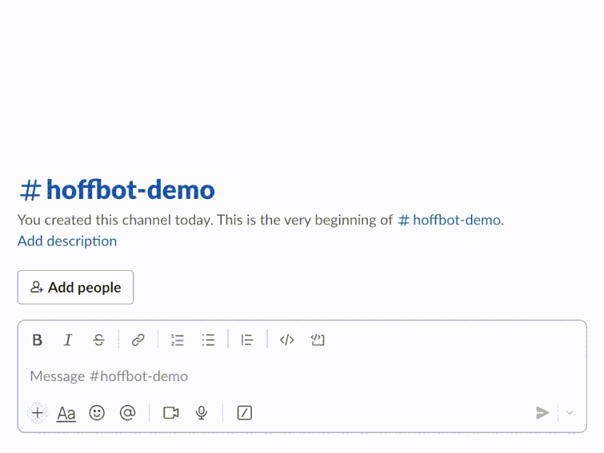

# Hoffbot :robot: :coffee:

<p align="center">

</p>

## Movitation
YouTube is rich in text data hidden in the subtitles included in each video.  You can imagine that having access to this text data in a way is equivalent to having access to the knowledge base of the YouTuber themself, so that either **conversational agents** mimicking their disposition or **retrieval-based chat bots** for question answering can be designed.  In this project we choose the latter of these two.

Using subtitles collected from ~200 [James Hoffman](https://www.youtube.com/channel/UCMb0O2CdPBNi-QqPk5T3gsQ) videos we design a chatbot capable of answering general coffee-related questions using explicitly the knowledge contained in his videos.  A first querying step is done through sentence embeddings with cosine similarity ranking on the corpus of subtitles, then a secondary reranking is performed with a cross-encoder. Finally we make use of Flan-T5 to extract the answer from the most relevant document, or acknowledge that the question is unanswerable.  

A user interface is also provided through the Slack API which allows users to interact with the bot over private messages. 
 
## requirements 
```
!pip install -r requirements.txt 
```

## outline 
### LLMs :hugs:
* [this t5 model for question answering](https://huggingface.co/MaRiOrOsSi/t5-base-finetuned-question-answering) (grazie gli :it:)
* [cosine similarity model](https://huggingface.co/sentence-transformers/multi-qa-MiniLM-L6-cos-v1)
* [crossencoder](https://huggingface.co/cross-encoder/ms-marco-MiniLM-L-6-v2)

### Deploying 
I'm kinda new to the frontend stuff so I made heavy use of [this playlist](https://www.youtube.com/watch?v=KJ5bFv-IRFM&list=PLzMcBGfZo4-kqyzTzJWCV6lyK-ZMYECDc) on youtube for Flask + Slack API integration. Also for the [chromadb](https://www.trychroma.com) part refer to [their docs](https://docs.trychroma.com). 

That being said, the pipline itself fully doesn't require Slack integration, I just figured it would be nice to provide an interface to everything.  So if you want to get a feel for the model/workflow check out the `t5skeleton.ipynb` file which is essentially the rough draft of this project entirely offline. 

## comments
If you want to regenerate any of the data included in the `clean` folder you'll need a functioning YouTube API key and to dig into the `youtube-api.ipynb` notebook.  Same goes for the embeddings but this time you'll need to use the `t5skeleton.ipynb`. Otherwise I've included the cleaned subtitle .vtt's as well as the embeddings I generated for the demo here in the repo already.

Hopefully didn't leave any of my API keys around, that would be bad.
